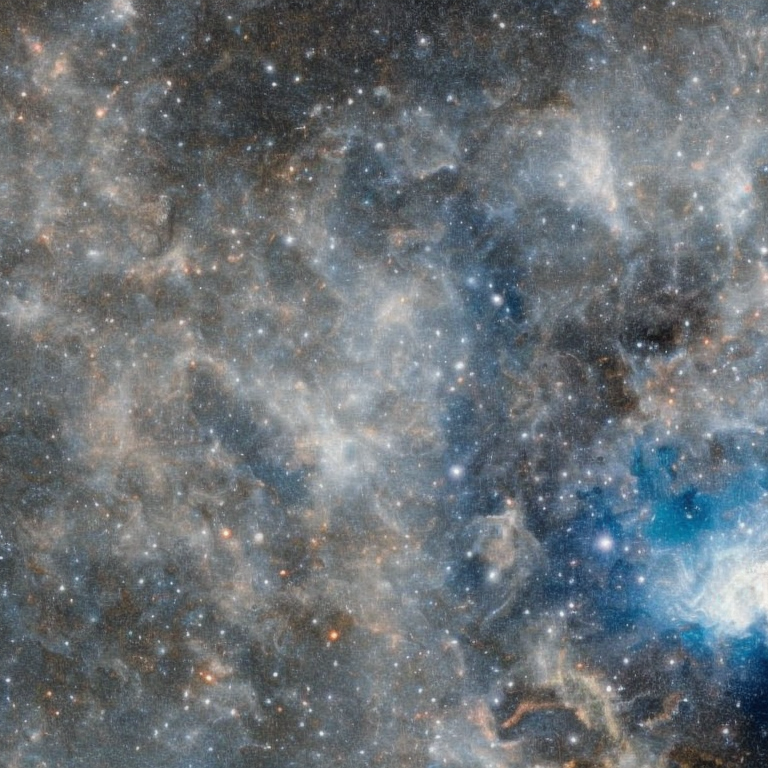

# Exploiting the Signal-Leak Bias in Diffusion Models

[](https://arxiv.org/abs/2309.15842)
[](https://ivrl.github.io/signal-leak-bias/)
[](https://openaccess.thecvf.com/content/WACV2024/html/Everaert_Exploiting_the_Signal-Leak_Bias_in_Diffusion_Models_WACV_2024_paper.html)


## Overview

This repository contains the official implementation for our paper titled "[Exploiting the Signal-Leak Bias in Diffusion Models](https://ivrl.github.io/signal-leak-bias/)", presented at [WACV 2024](https://openaccess.thecvf.com/content/WACV2024/html/Everaert_Exploiting_the_Signal-Leak_Bias_in_Diffusion_Models_WACV_2024_paper.html) 🔥

### 🔎 Research Highlights
- In the training of most diffusion models, data are never completely noised, creating a signal leakage and leading to discrepancies between training and inference processes.
- As a consequence of this signal leakage, the low-frequency / large-scale content of the generated images is mostly unchanged from the initial latents we start the generation process from, generating greyish images or images that do not match the desired style.
- Our research proposed to exploit this signal-leak bias at inference time to gain more control over generated images.
- We model the distribution of the signal leak present during training, to include a signal leak at inference time in the initial latents.
- ✨✨ No training required! ✨✨

### 📃 [Exploiting the Signal-Leak Bias in Diffusion Models](https://ivrl.github.io/signal-leak-bias/)

[Martin Nicolas Everaert](https://martin-ev.github.io/) <sup>1</sup>, [Athanasios Fitsios](https://www.linkedin.com/in/athanasiosfitsios/) <sup>1,2</sup>, [Marco Bocchio](https://scholar.google.com/citations?user=KDiTxBQAAAAJ) <sup>2</sup>, [Sami Arpa](https://scholar.google.com/citations?user=84FopNgAAAAJ) <sup>2</sup>, [Sabine Süsstrunk](https://scholar.google.com/citations?user=EX3OYP4AAAAJ) <sup>1</sup>, [Radhakrishna Achanta](https://scholar.google.com/citations?user=lc2HaZwAAAAJ) <sup>1</sup>

<sup>1</sup>[School of Computer and Communication Sciences, EPFL, Switzerland](https://www.epfl.ch/labs/ivrl/) ; <sup>2</sup>[Largo.ai, Lausanne, Switzerland](https://home.largo.ai/)

**Abstract**: There is a bias in the inference pipeline of most diffusion models. This bias arises from a signal leak whose distribution deviates from the noise distribution, creating a discrepancy between training and inference processes. We demonstrate that this signal-leak bias is particularly significant when models are tuned to a specific style, causing sub-optimal style matching. Recent research tries to avoid the signal leakage during training. We instead show how we can exploit this signal-leak bias in existing diffusion models to allow more control over the generated images. This enables us to generate images with more varied brightness, and images that better match a desired style or color. By modeling the distribution of the signal leak in the spatial frequency and pixel domains, and including a signal leak in the initial latent, we generate images that better match expected results without any additional training.


## Getting Started

### Code and development environment

Clone this repository: 

```bash
git clone https://github.com/IVRL/signal-leak-bias
cd signal-leak-bias/src
```

Our code mainly builds on top of the code of the [🤗 Diffusers](https://huggingface.co/docs/diffusers/index) library.
Run the following command to install our dependencies:

```bash
pip install diffusers==0.25.1
pip install accelerate==0.26.1
pip install transformers==4.26.1
```

### Computing statistics of the signal leak

The provided Python file for computing statistics of the signal leak can be used, for example, as follows:

```bash
python signal_leak.py \
  --pretrained_model_name_or_path="stabilityai/stable-diffusion-2-1"  \
  --data_dir="path/to/natural/images" \
  --output_dir="examples/C" \
  --resolution=768 \
  --n_components=3 \
  --statistic_type="dct+pixel" \
  --center_crop
```

### Inference

Once the statistics have been computed, you can use them to sample a signal leak at inference time too, for instance as follows:

```python
from signal_leak import sample_from_stats

signal_leak = sample_from_stats(path="examples/C")

```

Images can be generated with the sampled signal leak in the initial latents, for instance as follows:
```python
from diffusers import StableDiffusionPipeline
import torch

pipeline = StableDiffusionPipeline.from_pretrained("stabilityai/stable-diffusion-2-1").to("cuda")
num_inference_steps = 50

# Get the timestep T of the first reverse diffusion iteration
pipeline.scheduler.set_timesteps(num_inference_steps, device="cuda")
first_inference_timestep = pipeline.scheduler.timesteps[0].item()

# Calculate the expected amount of signal and noise at timestep T
sqrt_alpha_prod = pipeline.scheduler.alphas_cumprod[first_inference_timestep] ** 0.5
sqrt_one_minus_alpha_prod = (1 - pipeline.scheduler.alphas_cumprod[first_inference_timestep]) ** 0.5

# Generate the initial latents, with signal leak
latents = torch.randn([1, 4, 96, 96]) # original initial latents, without signal leak
latents = sqrt_alpha_prod * signal_leak + sqrt_one_minus_alpha_prod * latents

# Generate images
image = pipeline(
    prompt = "An astronaut riding a horse",
    num_inference_steps = num_inference_steps,
    latents = latents,
).images[0]
```

## Examples

### Improving style-tuned models

Models tuned on specific styles often produce results that do not match the styles well (see the second column of the next two tables). We argue that this is because of a discrepancy between training (contains a signal leak whose distribution differs from unit/standard multivariate Gaussian) and inference (no signal leak). We fix this discrepancy by modelling the signal leak present during training and including a signal leak (see third column) at inference time too. We use a "pixel" model, that is we estimate the mean and variance of each pixel (spatial elements of the latent encodings).

In the 2 following examples, we show how to fix two models:
- [sd-dreambooth-library/nasa-space-v2-768](https://huggingface.co/sd-dreambooth-library/nasa-space-v2-768) is a model tuned with [DreamBooth](https://huggingface.co/docs/diffusers/en/training/dreambooth) (Ruiz et al., 2022) on 24 images of the sky.
- [sd-concepts-library/line-art](https://huggingface.co/sd-concepts-library/line-art) is an embedding for [Stable Diffusion v1.4](https://huggingface.co/CompVis/stable-diffusion-v1-4) trained with [Textual Inversion](https://huggingface.co/docs/diffusers/training/text_inversion) (Gal et al, 2022) on 7 images with line-art style.


#### Example 1

```bash
# Clone the repository with the images
git clone https://huggingface.co/sd-dreambooth-library/nasa-space-v2-768

# Compute statistics of the signal leak from the images
python signal_leak.py \
  --pretrained_model_name_or_path="stabilityai/stable-diffusion-2-1" \
  --data_dir="nasa-space-v2-768/concept_images" \
  --output_dir="examples/A1/" \
  --resolution=768 \
  --statistic_type="pixel" \
  --center_crop

# We do not need the original images anymore
rm -rf nasa-space-v2-768 

# Generate image with our signal-leak bias
python -m examples.A1.generate
```

**Model:** [sd-dreambooth-library/nasa-space-v2-768](https://huggingface.co/sd-dreambooth-library/nasa-space-v2-768), with guidance_scale = 1

**Prompt:** "A very dark picture of the sky, Nasa style"

| Initial latents | Generated image (original) | + Signal Leak | Generated image (ours) |
| --------------- | -------------------------- | ------------- | ---------------------- |
|   |   |   |      |
|   |   |   |      |
|   |   |   |      |
|   |   |   |      |
|   |   |   |      |

#### Example 2

```bash
git clone https://huggingface.co/sd-concepts-library/line-art

python signal_leak.py \
  --pretrained_model_name_or_path="CompVis/stable-diffusion-v1-4" \
  --data_dir="line-art/concept_images" \
  --output_dir="examples/A2/" \
  --resolution=512 \
  --statistic_type="pixel" \
  --center_crop
  
rm -rf line-art
    
python -m examples.A2.generate
```

**Model:** [CompVis/stable-diffusion-v1-4](https://huggingface.co/CompVis/stable-diffusion-v1-4) + [sd-concepts-library/line-art](https://huggingface.co/sd-concepts-library/line-art)

**Prompt:** "An astronaut riding a horse in the style of `<line-art>`"

| Initial latents | Generated image (original) | + Signal Leak | Generated image (ours) |
| --------------- | -------------------------- | ------------- | ---------------------- |
|   |   |   |      |
|   |   |   |      |
|   |   |   |      |
|   |   |   |      |
|   |   |   |      | 

### Training-free style adaptation of Stable Diffusion 

The same approach as the previous example can be used directly in the base diffusion model, instead of the model finetuned on a style. That is, we include a signal leak at inference time to bias the image generation towards the desired style.

Without our approach (see second column of the next two tables), the prompt alone is not sufficient enough to generate picture of the desired style. Complementing it with a signal leak of the style (third column) generates images (last column) that better match the desired output.

#### Example 1

```bash 
python -m examples.B1.generate
```

**Model:** [stabilityai/stable-diffusion-2-1](https://huggingface.co/stabilityai/stable-diffusion-2-1), with guidance_scale = 1

**Prompt:** "A very dark picture of the sky, taken by the Nasa."

| Initial latents | Generated image (original) | + Signal Leak | Generated image (ours) |
| --------------- | -------------------------- | ------------- | ---------------------- |
|   |   |   |      |
|   |   |   |      |
|   |   |   |      |
|   |   |   |      |
|   |   |   |      |

#### Example 2

```bash 
python -m examples.B2.generate
```

**Model:** [CompVis/stable-diffusion-v1-4](https://huggingface.co/CompVis/stable-diffusion-v1-4)

**Prompt:** "An astronaut riding a horse, in the style of line art, pastel colors."

| Initial latents | Generated image (original) | + Signal Leak | Generated image (ours) |
| --------------- | -------------------------- | ------------- | ---------------------- |
|   |   |   |      |
|   |   |   |      |
|   |   |   |      |
|   |   |   |      |
|   |   |   |      | 
  
### More diverse generated images 

In the previous examples, the signal leak is modelled with a "pixel" model, realigning the training and inference distributions for stylized images. For *natural* images, the disrepency between training and inference distribution mostly lies in the frequency components: noised images during training still retain the low-frequency contents (large-scale patterns, main colors) of the original images, while the initial latents during inference always have medium low-frequency contents (e.g. *greyish* average color). Compared to the examples above, we then additionnaly model the low-frequency content of the signal leak, using a small set of natural images. 

In the next examples, we will use [this set of 128 images](https://github.com/ultralytics/yolov5/releases/download/v1.0/coco128.zip) from [COCO](https://cocodataset.org/)


```bash
wget https://github.com/ultralytics/yolov5/releases/download/v1.0/coco128.zip
unzip coco128
rm coco128.zip
mv coco128/images/train2017 coco128_images
rm -r coco128

python signal_leak.py \
  --pretrained_model_name_or_path="stabilityai/stable-diffusion-2-1" \
  --data_dir="coco128_images" \
  --output_dir="examples/C/" \
  --resolution=768 \
  --n_components=3 \
  --statistic_type="dct+pixel" \
  --center_crop
  
rm -r coco128_images

python -m examples.C.generate
```

**Model:** [stabilityai/stable-diffusion-2-1](https://huggingface.co/stabilityai/stable-diffusion-2-1)

**Prompt:** "An astronaut riding a horse"

| Initial latents | Generated image (original) | + Signal Leak | Generated image (ours) |
| --------------- | -------------------------- | ------------- | ---------------------- |
|   |   |   |      |
|   |   |   |      |
|   |   |   |      |
|   |   |   |      |
|   |   |   |      |
  
### Control on the average color

In the previous example, the signal leak given at inference time is sampled randomly from the statistics of the signal leak  present at training time. Instead, it is also possible to *manually* set its low-frequency components, providing control on the low-frequency content of the generated image, as we show in the following example. 

```bash
wget https://github.com/ultralytics/yolov5/releases/download/v1.0/coco128.zip
unzip coco128
rm coco128.zip
mv coco128/images/train2017 coco128_images
rm -r coco128

python signal_leak.py \
  --pretrained_model_name_or_path="stabilityai/stable-diffusion-2-1" \
  --data_dir="coco128_images" \
  --output_dir="examples/D/" \
  --resolution=768 \
  --n_components=1 \
  --statistic_type="dct+pixel" \
  --center_crop
  
rm -r coco128_images
  
python -m examples.D.generate
```

**Model:** [stabilityai/stable-diffusion-2-1](https://huggingface.co/stabilityai/stable-diffusion-2-1)

**Prompt:** "An astronaut riding a horse"

| Channel | -2 | -1 | 0 | 1 | 2 |
| -------------- | -- | -- | - | - | - |
| 0 |  |  |  |  |  |
| 1 |  |  |  |  |  |
| 2 |  |  |  |  |  |
| 3 |  |  |  |  |  | 

# License

The implementation here is provided solely as part of the research publication "[Exploiting the Signal-Leak Bias in Diffusion Models](https://ivrl.github.io/signal-leak-bias/)", only for academic non-commercial usage. Details can be found in the [LICENSE file](https://github.com/ivrl/signal-leak-bias/blob/main/LICENSE). If the License is not suitable for your business or project, please contact Largo.ai (info@largo.ai) and EPFL-TTO (info.tto@epfl.ch) for a full commercial license.

# Citation
Please cite the paper as follows:

```
@InProceedings{Everaert_2024_WACV,
      author   = {Everaert, Martin Nicolas and Fitsios, Athanasios and Bocchio, Marco and Arpa, Sami and Süsstrunk, Sabine and Achanta, Radhakrishna},
      title    = {{E}xploiting the {S}ignal-{L}eak {B}ias in {D}iffusion {M}odels}, 
      booktitle = {Proceedings of the IEEE/CVF Winter Conference on Applications of Computer Vision (WACV)},
      month     = {January},
      year      = {2024},
      pages     = {4025-4034}
}
```
